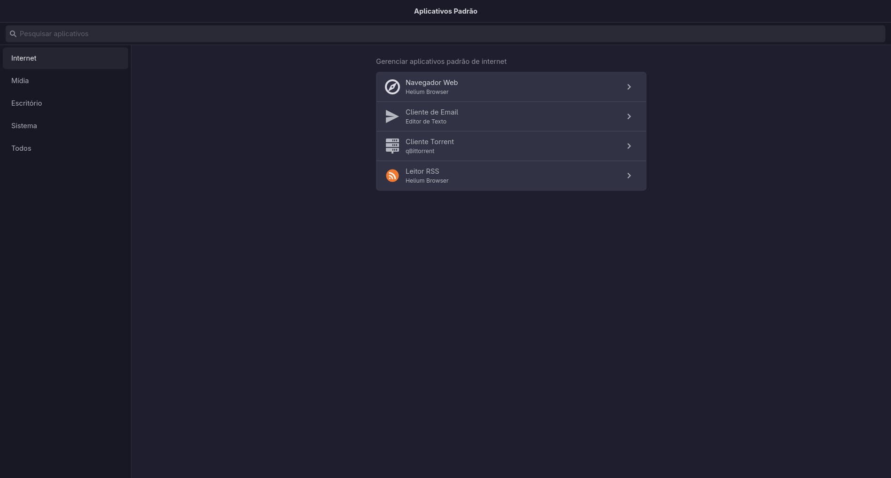

# Default Apps Manager

A beautiful, modern Linux desktop application built with **Rust + GTK4 + libadwaita** that lets you easily manage your system's default applications — a native alternative to manually editing `mimeapps.list`.

## Features

-   **Category-based browsing** — Internet, Media, Office, System
-   **Quick search** — filter across all categories
-   **Simple app selection** — pick any installed application as default
-   **Native GNOME experience** — uses libadwaita, follows GNOME HIG
-   **i18n** — English and Portuguese (pt_BR) built-in
-   **Light/Dark/High Contrast** — follows system theme automatically

## Screenshots



## Building

### Dependencies

-   Rust 1.80+
-   GTK4 >= 4.14
-   libadwaita >= 1.5
-   pkg-config
-   meson (if building with Flatpak)

### Build from source

```bash
git clone https://github.com/tomas-barros1/xdg-mime-gui.git
cd xdg-mime-gui
cargo build --release
```

### Run

```bash
cargo run --release
```

### Install to system

```bash
make install
```

## Usage

1.  Open **Default Applications** from your app launcher
2.  Select a category from the sidebar (Internet, Media, Office, System, or All)
3.  Click the `>` button next to any entry
4.  Choose an application from the list and click **Set Default**

To search, simply type in the search bar — the view will automatically switch to **All** and filter matching entries.

## Translation

The app detects your locale from the `LANG` environment variable.

Add a new locale by creating a JSON file in `locales/` and importing it in `src/i18n.rs`.

| Language    | File               | Status |
| ----------- | ------------------ | ------ |
| English     | `locales/en.json`  | ✅     |
| Portuguese  | `locales/pt_BR.json`  | ✅     |

## Project Structure

```
src/
├── main.rs              — Entry point
├── application.rs       — AdwApplication setup
├── window.rs            — Main window with NavigationSplitView + search
├── i18n.rs              — Translation module
├── models/
│   ├── application.rs   — AppInfo wrapper
│   └── mime_type.rs     — Category/entry definitions
├── services/
│   ├── app_discovery.rs — Discover installed apps
│   ├── default_apps.rs  — Get/set default apps
│   └── mime_database.rs — MIME type utilities
└── ui/
    ├── pages/           — Category pages
    └── widgets/         — Reusable widgets
```

## License

[MIT](LICENSE)
